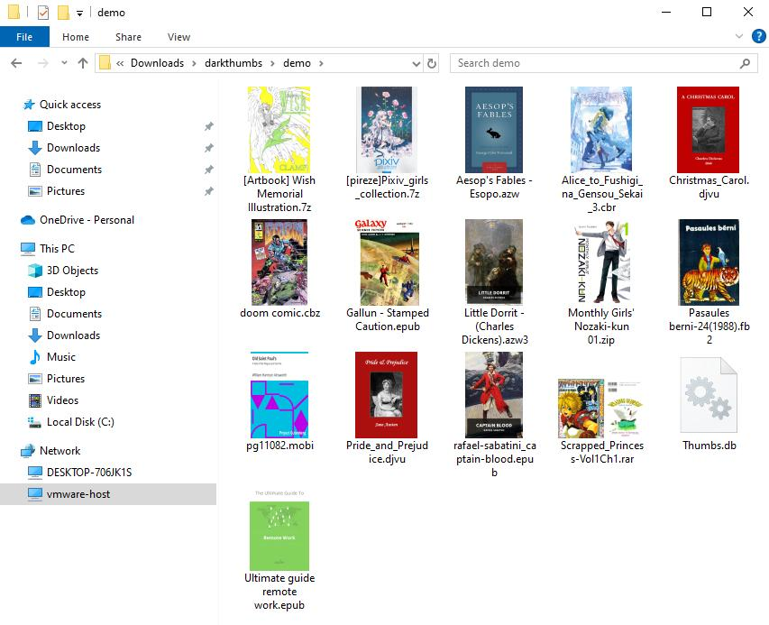
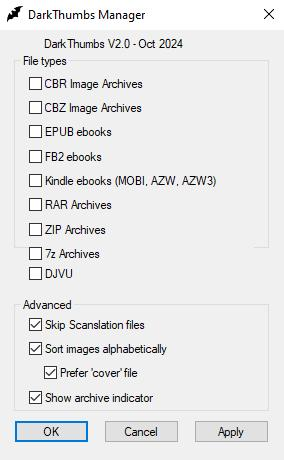

# DarkThumbs
Thumbnail preview support for ebooks and various archive formats in Windows File Explorer. V2.0 adds DJVU and 7Z/CB7 support!

## Screenshots

## Supported formats
- EPUB
- FB2
- Kindle (MOBI, AZW, AZW3)
- DJVU / DJV
- 7Z
- CB7
- CBZ
- CBR
- RAR
- ZIP

## Minimium system requirements
Windows 7/8/8.1/10/11 (64-bit)

## Built with
Visual Studio 2019 using Windows 10 SDK. Requires the Microsoft "Visual Studio Installer" extension to build the setup projects.

**With a Little Help From ...**

 - [Deleaker](https://www.deleaker.com) : the _best_ tool for finding memory, GDI and other leaks!

## Credits

### Source Code
Used [Invertex's CBXShell](https://github.com/Invertex/CBXShell) as a base

MOBI support thanks to [libmobi](https://github.com/bfabiszewski/libmobi)

7Z support via [bit7z](https://github.com/rikyoz/bit7z)

### Application Icon
Icons made by [Those Icons](https://www.flaticon.com/authors/those-icons) from [Flaticon](https://www.flaticon.com/)

- Sponsored by [L0garthimic](https://github.com/L0garithmic)
- V1.0 by [dark-knight404](https://github.com/dark-knight404)
- V1.1-V2.0 by [fire-eggs](https://github.com/fire-eggs)
